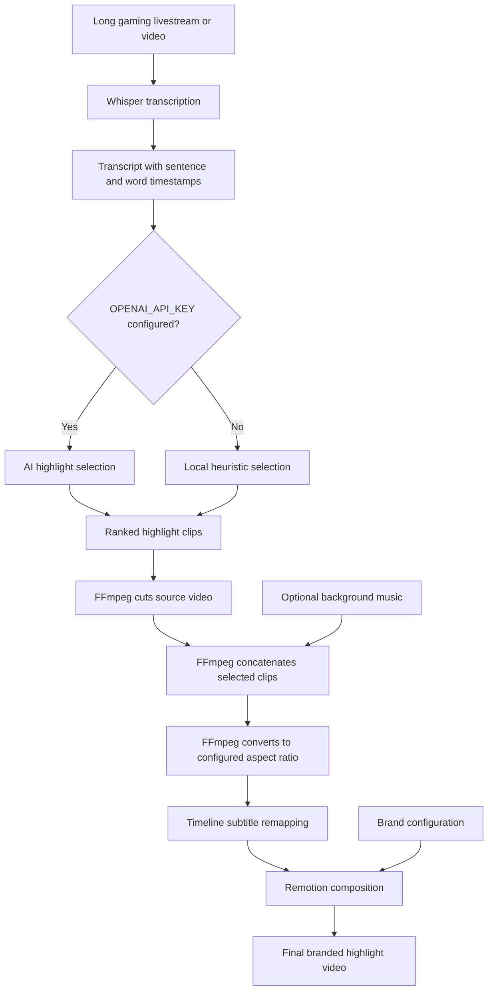

this repo is an automated video editing pipeline for turning long gaming livestreams, gameplay recordings, podcasts, interviews, and webinars into polished highlight videos.

The project is **landscape-first** and outputs `1920×1080` videos by default, making it suitable for:

- Gaming livestream highlights
- Twitch and YouTube VOD recaps
- Funny gameplay moments
- Clutch plays and reactions
- Speedrun attempts
- Tutorials and commentary
- Podcast and interview highlights

Portrait `9:16` output is also supported when needed for TikTok, YouTube Shorts, or Instagram Reels.

---

## What it does

Shorts Factory automates the repetitive parts of editing a long video:

1. Transcribes speech with Whisper.
2. Detects timestamps for sentences and individual words.
3. Selects engaging moments with AI.
4. Uses a local heuristic fallback when no AI API key is available.
5. Cuts and joins clips with FFmpeg.
6. Converts the result to the configured aspect ratio.
7. Adds animated word-by-word subtitles.
8. Adds branding, logo, watermark, and optional music.
9. Renders the final video with Remotion.

For a gaming livestream, the system can help turn a multi-hour recording into several short highlight videos without manually reviewing every minute of footage.

---

## How it works

### Pipeline overview



### Processing stages

#### 1. Transcription with Whisper

Whisper analyzes the audio track and creates a cached transcript containing:

- Detected language
- Sentence start and end timestamps
- Word-level timestamps
- Original transcript text

Example:

```json
{
  "start": 12.4,
  "end": 18.9,
  "text": "That was the most important play of the game.",
  "words": [
    {
      "word": "That",
      "start": 12.4,
      "end": 12.7
    },
    {
      "word": "important",
      "start": 13.9,
      "end": 14.5
    }
  ]
}
```

The transcript is saved to:

```text
out/transcript.json
```

The cache allows you to rerun clip selection or rendering without transcribing the source video again.

#### 2. Highlight selection

When `OPENAI_API_KEY` is available, the transcript is sent to the configured OpenAI-compatible model for highlight selection.

The AI looks for moments such as:

- Exciting gameplay
- Clutch decisions
- Funny reactions
- Surprising events
- Strong emotional moments
- Useful tips or insights
- Self-contained moments that make sense outside the full livestream

For gaming content, the transcript is especially useful for finding moments where the streamer reacts strongly, explains a strategy, celebrates a win, or describes what just happened.

#### 3. Local fallback selection

If no API key is configured, or if the AI request fails, the project uses a local deterministic heuristic.

The fallback considers:

- Hook words such as `secret`, `mistake`, `why`, `how`, and `solution`
- Questions and exclamations
- Speech density
- Segment length
- Clip overlap

This means the pipeline can still run locally without an external AI service.

> Note: transcript-based selection works best for moments with spoken commentary. Purely visual moments with no speech may require additional scene or audio analysis in a future extension.

#### 4. FFmpeg editing

FFmpeg performs the media operations:

- Cuts individual clips using timestamps
- Re-encodes video and audio
- Concatenates selected clips
- Optionally mixes background music
- Converts the output to `1920×1080` for `16:9`
- Converts the output to `1080×1920` for `9:16`

#### 5. Subtitle timeline remapping

Selected clips come from different positions in the original livestream. After concatenation, their timestamps no longer match the original video timeline.

Shorts Factory remaps each subtitle timestamp to the new concatenated timeline:

```text
Original livestream timeline:
[clip A at 02:10] ........ [clip B at 48:32]

Final highlight timeline:
[clip A at 00:00] [clip B after clip A]
```

This keeps the subtitles synchronized after clips are cut and merged.

#### 6. Remotion rendering

Remotion renders the final composition with:

- Landscape `1920×1080` output by default
- Optional portrait `1080×1920` output
- Word-by-word animated captions
- Highlighting for the currently spoken word
- Brand name and watermark
- Optional logo
- Accent color
- Font configuration
- Gradient overlay for subtitle readability
- Progress bar

---

## Project structure

```text
.
├── pyproject.toml
├── config.example.yml
├── README.md
│
├── shorts_factory/
│   ├── models.py          # Data models and pipeline configuration
│   ├── transcriber.py     # Whisper transcription and transcript cache
│   ├── selector.py        # AI selector and local heuristic fallback
│   ├── ffmpeg.py          # Cut, concatenate, music mix, and resize
│   ├── pipeline.py        # End-to-end pipeline orchestration
│   └── cli.py             # Command-line interface
│
├── remotion/
│   ├── package.json
│   ├── tsconfig.json
│   └── src/
│       ├── index.tsx      # Remotion composition registration
│       └── ShortVideo.tsx # Video layout, subtitles, and branding
│
└── tests/
    └── test_selector.py   # Highlight selection tests
```

---

## Requirements

- Python `3.11+`
- Node.js `20+`
- npm
- FFmpeg
- macOS, Linux, or Windows
- GPU is optional but can significantly improve Whisper performance
- OpenAI API key is optional

Check installed versions:

```bash
python3 --version
node --version
npm --version
ffmpeg -version
```

---

## Installation

### 1. Install FFmpeg

#### macOS with Homebrew

```bash
brew install ffmpeg
```

#### Ubuntu or Debian

```bash
sudo apt update
sudo apt install ffmpeg
```

#### Windows

Install FFmpeg using one of the following options:

- Download a build from the official FFmpeg website.
- Install with Chocolatey:

```powershell
choco install ffmpeg
```

- Install with Scoop:

```powershell
scoop install ffmpeg
```

Verify the installation:

```bash
ffmpeg -version
```

### 2. Install Python dependencies

From the project root:

```bash
python3 -m pip install -e '.[dev]'
```

This installs:

- `openai-whisper`
- `openai`
- `pydantic`
- `pyyaml`
- `pytest`

The first Whisper run may download the selected Whisper model.

### 3. Install Remotion dependencies

```bash
npm install --prefix remotion
```

### 4. Validate the installation

```bash
python3 -m compileall -q shorts_factory tests
python3 -m pytest -q
npx --prefix remotion tsc --noEmit -p remotion/tsconfig.json
```

---

## Configuration

Copy the example configuration:

```bash
cp config.example.yml config.yml
```

Example landscape gaming configuration:

```yaml
input: media/gameplay-vod.mp4
output_dir: out

model: base
language: null

clip_count: 3
min_clip_seconds: 12
max_clip_seconds: 55
padding_seconds: 1.5

# Landscape output for gaming videos
aspect_ratio: "16:9"

ai_model: gpt-4o-mini

brand:
  name: "Your Gaming Channel"
  accent: "#7C3AED"
  text_color: "#FFFFFF"
  font_family: "Arial"
  logo_path: null
  watermark: true

music_path: null
```

### Configuration options

| Option | Description |
|---|---|
| `input` | Path to the long source video |
| `output_dir` | Directory for generated artifacts |
| `model` | Whisper model, such as `tiny`, `base`, `small`, `medium`, or `large` |
| `language` | Spoken language; use `null` for automatic detection |
| `clip_count` | Maximum number of highlights to select |
| `min_clip_seconds` | Minimum target duration for a clip |
| `max_clip_seconds` | Maximum target duration for a clip |
| `padding_seconds` | Extra time added before and after a selected segment |
| `aspect_ratio` | `"16:9"` for landscape or `"9:16"` for portrait |
| `ai_model` | Model used for AI highlight selection |
| `brand.name` | Channel or brand name |
| `brand.accent` | Subtitle highlight and progress-bar color |
| `brand.text_color` | Main subtitle and watermark color |
| `brand.font_family` | Font family used by the Remotion composition |
| `brand.logo_path` | Optional logo path |
| `brand.watermark` | Enables or disables the brand watermark |
| `music_path` | Optional background music file |

### Aspect ratios

Landscape is the default:

```yaml
aspect_ratio: "16:9"
```

Output:

```text
1920×1080
```

Portrait is also supported:

```yaml
aspect_ratio: "9:16"
```

Output:

```text
1080×1920
```

For gaming livestreams and standard YouTube highlight videos, use `16:9`.

---

## Optional AI configuration

To enable AI-powered highlight selection:

```bash
export OPENAI_API_KEY="your-api-key"
```

On Windows PowerShell:

```powershell
$env:OPENAI_API_KEY="your-api-key"
```

When the key is not configured:

- No transcript is sent to an external AI provider.
- Highlight selection uses the local heuristic.
- Whisper still runs locally.

---

## Usage

### Run the complete pipeline

```bash
shorts media/gameplay-vod.mp4 \
  --config config.yml \
  --output out \
  --render
```

The equivalent Python command is:

```bash
python3 -m shorts_factory.cli media/gameplay-vod.mp4 \
  --config config.yml \
  --output out \
  --render
```

### Select more highlights

```bash
shorts media/gameplay-vod.mp4 \
  --config config.yml \
  --clips 5 \
  --output out \
  --render
```

### Use an existing transcript

If a transcript already exists, skip Whisper:

```bash
shorts media/gameplay-vod.mp4 \
  --transcript transcript.json \
  --output out \
  --render
```

This is useful when:

- Iterating on the Remotion design
- Rerunning the pipeline multiple times
- Testing different clip counts
- Running in CI/CD
- Avoiding repeated transcription

### Preview Remotion

Start the Remotion Studio:

```bash
npm run start --prefix remotion
```

---

## Generated files

A successful run produces:

```text
out/
├── transcript.json
├── clips/
│   ├── clip-01.mp4
│   ├── clip-02.mp4
│   └── clip-03.mp4
├── assembled.mp4
├── vertical-source.mp4
├── render-manifest.json
└── short.mp4
```

File descriptions:

| File | Description |
|---|---|
| `transcript.json` | Whisper transcript with timestamps |
| `clips/clip-*.mp4` | Individual selected highlights |
| `assembled.mp4` | Selected clips concatenated together |
| `vertical-source.mp4` | Aspect-ratio-normalized source for rendering |
| `render-manifest.json` | Manifest passed to Remotion |
| `short.mp4` | Final branded highlight video |

`vertical-source.mp4` is retained as a legacy filename. It may contain landscape `16:9` content when landscape mode is selected.

---

## Testing and development

Run Python tests:

```bash
python3 -m pytest -q
```

Check Python syntax:

```bash
python3 -m compileall -q shorts_factory tests
```

Check TypeScript:

```bash
npx --prefix remotion tsc --noEmit -p remotion/tsconfig.json
```

Start Remotion Studio:

```bash
npm run start --prefix remotion
```

---

## Limitations

- Transcript-based selection is strongest for spoken commentary.
- Silent visual highlights may not be detected without additional scene-analysis logic.
- The first Whisper run may download a large model.
- Larger Whisper models require more memory and processing time.
- FFmpeg is required for all media editing stages.
- No source video is included in the repository.
- AI selection only runs when `OPENAI_API_KEY` is configured.
- If AI selection fails, the pipeline falls back to local heuristic scoring.
- Logo paths must be accessible to the Remotion rendering environment.

---

